# SyncToFTP

监控一个文件,发生修改后,将文件整体同步到FTP服务器.

### 流程图



### 参考

```
# ftplib — FTP protocol client:
# https://docs.python.org/3/library/ftplib.html
# How to Install Python PIP on Windows, Mac, and Linux
# https://www.makeuseof.com/tag/install-pip-for-python/
# Python入门七：安装支持WinXp运行的Python及环境配置
# https://blog.csdn.net/zjm12343/article/details/79738396
```